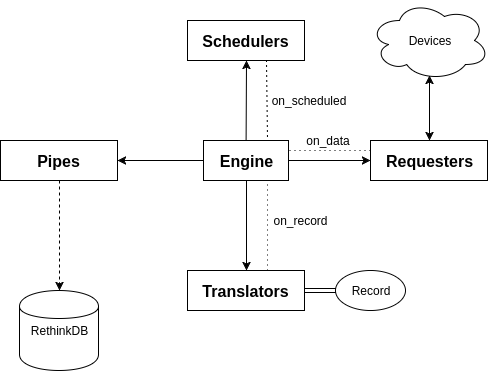

Architecture
============

The NEAT project features the main communication engine as well as several *appendages* including mainly **schedulers**, **requesters**, **translators**, and **pipes**. A simple communication visualization is shown in the figure below.

These so called appendages are described within submodules of the main :mod:`neat` module as generalized in the following file structure.
As you can see, the following folder structure allows for separated logic in each of the submodules while keeping connection and communication logic within the engine::

  neat
  ├─ const.py
  ├─ client.py
  ├─ engine.py
  ├─ device.py
  ├─ scheduler
  │  ├─ __init__.py
  │  ├─ _common.py
  │  ├─ simple.py
  │  └─ ...
  ├─ requester
  │  ├─ __init__.py
  │  ├─ _common.py
  │  ├─ obvius.py
  │  └─ ...
  ├─ translator
  │  ├─ __init__.py
  │  ├─ _common.py
  │  ├─ obvius.py
  │  └─ ...
  └─ pipes
     ├─ __init__.py
     ├─ _common.py
     ├─ rethinkdb.py
     └─ ...

Submodule structure  mainly includes the  ``__init__.py`` and the ``_common.py`` files.
The ``_common.py`` exports an abstract class which all valid concrete classes should extend.
For example in ``requesters/_common.py`` an abstract class :class:`~neat.requester._common.AbstractRequester` is exported which the :class:`~neat.requester.obvius.ObviusRequester` extends.
The exported classes from the submodule should include the abstract class as well as any other concrete classes for  that submodule.
Because of this, concrete classes must be uniquely named and preferably have a matching suffix to their superclass.
For example, as previously shown the :class:`~neat.requester._common.AbstractRequester` is the superclass for the :class:`~neat.requester.obvius.ObviusRequester`.
The matching suffix of these two objects would in this case be *Requester*.
Other submodules with abstract and concrete classes should following this convention for readability reasons.

The following sections will describe in greater detail the objectives, responsibilities, and structure of the engine as well as the previously listed submodules.

Records
-------

The generic data model which neat produces is the :class:`~neat.models.record.Record` object found in ``models/record.py``.
This object specifies the ``to_dict`` method which compresses the useful object information into a dictionary using the following format (a more formal `jsonschema <http://json-schema.org/>`_ can be found in ``schemas/record.json``):

.. code-block:: json

  {
    "meta": {},
    "name": "primary key unique name",
    "device_name": "human readable non-unique name",
    "type": "DEVICE_TYPE",
    "timestamp": 1234567890,
    "coord": {
      "lon": 123.456789,
      "lat": -123.456789
    },
    "data": {
      "0": {
        "name": "unreliable-name",
        "value": 12.3456789,
        "units": "PINT_UNIT"
      }
    },
    "parsed": {
      "reliable-name": {
        "value": 12.3456789,
        "unit": "PINT_UNIT"
      }
    }
  }

This top-level json object is built from the :class:`~neat.models.record.Record` object in ``models/record.py``.
The shorter json objects in the data and parsed fields are built from the :class:`~neat.models.record.RecordPoint` object also in ``models/record.py``.
It's easy to see that the record point stores information about a data point such as the name, value, and an understandable unit expression from the `pint <https://pint.readthedocs.io/>`_ module's vanilla unit registry.

Engine
------

The engine's purpose is to manage communication between schedulers, requesters, translators, and pipes.
It does this by hooking into the schedulers, requesters, and translators `blinker <https://pythonhosted.org/blinker/>`_ signal in order to capture asynchronous output from the different running processes.

The engine should be accessed directly from the top-level module as the :class:`~neat.engine.Engine` class.
Schedulers are mapped 1 to 1 with their scheduled requesters in the engine's private ``_register`` attribute on initialization of the engine.
Along with this mapping the desired pipes are also passed into the engine on initialization as a list of pipe objects.
Note in the following intialization example that a single :class:`~neat.scheduler.simple.SimpleDelayScheduler` is mapped to a :class:`~neat.requester.obvius.ObviusRequester` for the engine's register while a single :class:`~neat.pipe.rethinkdb.RethinkDBPipe` is given engine.

.. code-block:: python

  import neat
  engine = neat.Engine({
      neat.scheduler.SimpleDelayScheduler(...):
      neat.requester.ObviusRequester(...)
  }, pipes=[neat.pipe.RethinkDBPipe(...)])

The engine's logic flow works as the following:

1. Schedulers are started as their own child processes of the engine
2. A scheduler communicates over its signal when its requester should run
3. Engine intercepts the scheduler's signal with the ``on_scheduled`` method
4. Engine determines what requester should run and calls the :func:`~neat.requester.obvius.ObviusRequester.request` method
5. A requester communicates over its signal when it receives  data
6. Engine intercepts the requester's signal with the ``on_data`` method
7. Engine determines which translator is *capable* of translating the received data and calls the ``translate`` method
8. A translator communicates over its signal when the :class:`~neat.models.record.Record` model has been built successfully
9. Engine intercepts the translator's signal with the ``on_record`` method
10. Engine throws the record into each of the valid pipes via the :func:`~neat.pipe.rethinkdb.RethinkDBPipe.accept` method
11. Pipes handle any necessary storage logic

Schedulers
----------

The purpose of a scheduler is to provide a way of telling the engine when a requester should be called.
Because these schedulers must execute with their own specific time-frames they are subclasses of :class:`~neat.scheduler._common.AbstractScheduler` which itself is a subclass of :class:`multiprocessing.Process` allowing these schedulers to be run as children processes of the process containing neat's engine.
The  :class:`~neat.scheduler._common.AbstractScheduler`  provides an anonymous blinker signal attribute and requires that concrete classes implement a :func:`~neat.scheduler.simple.SimpleDelayScheduler.run` method which starts (most likely) an infinite loop of request scheduling logic.

Although new schedulers may need to take into account device specific refresh rates or communication rules, most of the time the best option is to use the already provided :class:`~neat.scheduler.simple.SimpleDelayScheduler` from ``scheduler/simple.py`` which employs a delay by sleeping the process for a specified second delay.

.. note::
  Because schedulers are subclasses of :class:`multiprocessing.Process` if an ``__init__`` method is required of a concrete scheduler, the superclass's ``__init__`` must be called before any attribute assignment.

For example, the :class:`~neat.scheduler.simple.SimpleDelayScheduler` requires an input parameter to specify the second delay which should be used.
The following simplified class snippet was used:

.. code-block:: python

  class SimpleDelayScheduler(AbstractScheduler):

      def __init__(self, delay: float=1.0):
          super().__init__()
          self.delay = delay

Requesters
----------

The purpose of a requester is to ensure that some device's state is retrieved and passed back to the engine.
As opposed to schedulers, requesters are not their own spawned processes, instead they run alongside the engine when triggered from the ``on_scheduled`` signal.

Concrete requesters must extend from :class:`~neat.requester._common.AbstractRequester` which also provides an abstract blinker signal and requires that the requester implements a method :func:`~neat.requester.obvius.ObviusRequester.request` which sends some request to a device for current status.
In order to keep blocking to a minimum, requesters utilize the `requests <http://docs.python-requests.org/en/master/>`_ module and specify request hooks to be most optimal in not blocking engine execution.
Once the data has been retrieved the requester instance as well as the retrieved data and any additional named parameters to the requester's initialization is sent back over the requesters signal which can then be caught by the engine.
These additional parameters are typically :class:`~neat.models.record.Record` fields that need to be user-specified due to the device not containing that information.
An example of this is typically the longitude and latitude of the device since many devices do not keep track of that information.

Take the following requester initialization for example:

.. code-block:: python

  requester = neat.requester.ObviusRequester(
      obvius_ip='123.123.123.123',
      obvius_port=80,
      obvius_user='SOMEUSER',
      obvius_pass='SOMEPASS',
      name='DEVICE_NAME',
      type='DEVICE_TYPE',
      lat=123.4567890,
      lon=123.4567890
  )

In this instance, although :class:`~neat.requester.obvius.ObviusRequester` cannot handle ``lat`` and ``lon`` in requester initialization, it still requires those fields in order for the translator to have those fields handy when building the :class:`~neat.models.record.Record`.
Therefore, the extraneous fields which cannot be used in initialization for the requester are included in the signal along with the data and the requester instance.

Translators
-----------

The purpose of a translator is to provide a simple interface to create a :class:`~neat.models.record.Record` object from some data retrieved by a requester.
A single given translator may be acceptable for translating multiple formats of data.
This is specified in the ``supported_requesters`` attribute of a concrete translator as a list of string class names of the supported requesters.

.. note::
  The current method of translator discovery is *naive* as it returns the first translator is sees which specifies that it can handle data from a specific requester.
  This process can be seen in ``translators/__init__.py`` as :func:`~neat.translator.get_translator`.

Valid concrete translators must extend from ``AbstractTranslator`` as usual.
:class:`~neat.translator._common.AbstractTranslator` provides an anonymous blinker signal and requires a :func:`~neat.translator.obvius.ObviusTranslator.translate` method for synchronously creating and sending the built :class:`~neat.models.record.Record` object over the provided signal.

Note the engine lazily instantiates the translators only when they are required.
Therefore, initialization parameters to concrete translators is currently not supported in the neat engine.

Device Types
------------

The purpose of a device type is to ensure that the data comming in from multiple different types of devices from multiple requesters can have their points generalized into the ``parsed`` field of a :class:`~neat.models.record.Record`.
The allowed device types are stored in the ``device.py`` and are encapsulated within the :class:`~neat.device.DeviceType` enumeration along with a unique hexadecimal id and an instance to the device.
Correct parsing of the data fields currently relies on the ``parsed`` fields contained within the ``config.yml``.
With the addition of new device types and different requesters that do no utilize the Obvius' device points, it may be neccessary to change the logic of the :func:`~neat.device.AbstractDevice.parse` function.

The :func:`~neat.device.AbstractDevice.parse` function takes the populated data fields along with the ``parsed`` config configuration to determine what attributes of the record's ``data`` to load and convert to a uniform `pint <https://pint.readthedocs.io/en/0.7.2/>`_ unit.
This information is the placed within the ``parsed`` dictionary of the :class:`~neat.models.record.Record` which can then be serialized for the pipe's usage.

Pipes
-----

The purpose of a pipe is to provide any and all logic for handling the storage created records into various different formats.
The provided concrete pipe is a :class:`~neat.pipe.rethinkdb.RethinkDBPipe` which places records into a `rethinkdb <https://www.rethinkdb.com/>`_ database as they come in.

Valid pipes must extend from :class:`~neat.pipe._common.AbstractPipe` which provides an anonymous blinker signal and requires that the pipe have an :func:`~neat.pipe.rethinkdb.RethinkDBPipe.accept` method which accepts a single :class:`~neat.models.record.Record` object.
Once a record has been successfully committed to wherever it needs to be, the pipe must send itself and the record over the provided signal where the engine can intercept the signal in the ``on_complete`` signal.
